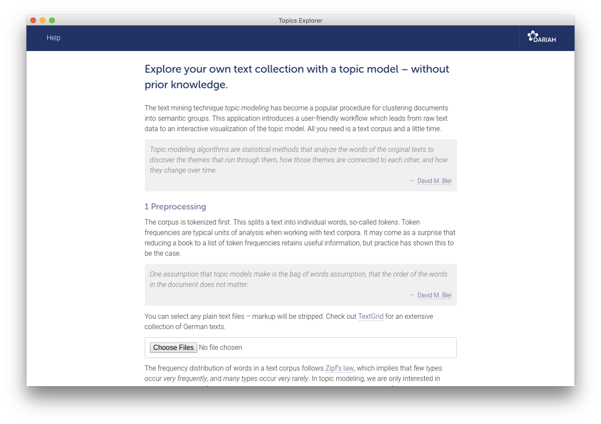
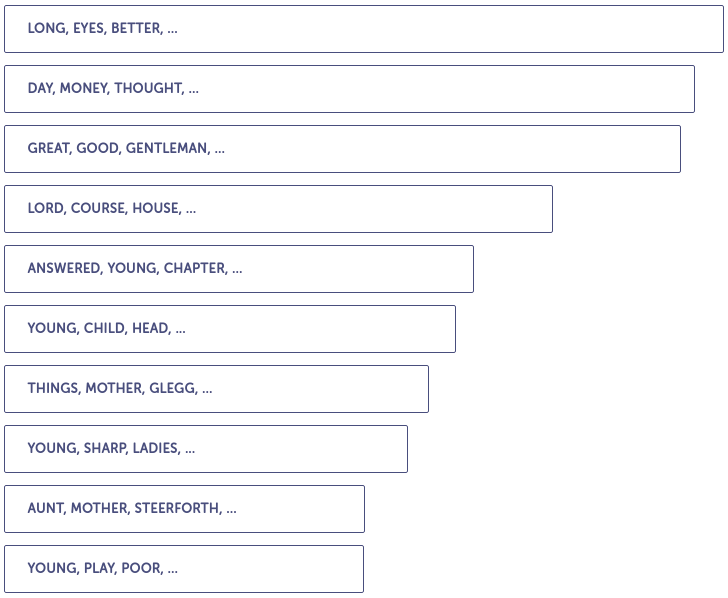
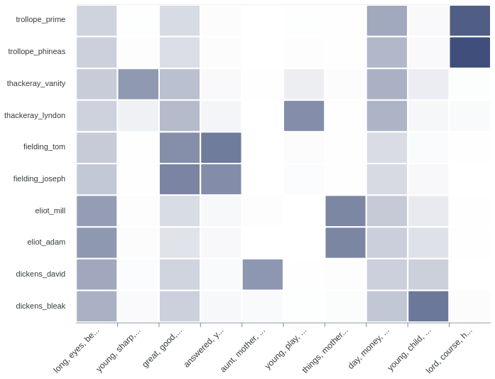

# Explore your own text collection with a topic model – without prior knowledge.
The text mining technique _topic modeling_ has become a popular procedure for clustering documents into semantic groups. This application introduces a user-friendly workflow which leads from raw text data to an interactive visualization of the topic model. All you need is a text corpus and a little time.

> Topic modeling algorithms are statistical methods that analyze the words of the original texts to discover the themes that run through them, how those themes are connected to each other, and how they change over time. – [David M. Blei](http://www.cs.columbia.edu/~blei/papers/Blei2012.pdf)


## Overview
* [Getting started](#getting-started)
* [The application](#the-application)
* [The sample corpus](#the-sample-corpus)
* [Example visualizations](#example-visualiztaions)
* [Troubleshooting](#troubleshooting)
* [Developing](#developing)
* [What is topic modeling?](#what-is-topic-modeling?)
* [What is DARIAH-DE?](#what-is-dariah-de?)
* [License](#license)


## Getting started
Windows, macOS and Linux users **do not** have to install additional software. The application itself is [portable](https://en.wikipedia.org/wiki/Portable_application).

1. Go to the [release-section](https://github.com/DARIAH-DE/TopicsExplorer/releases/latest) and download the ZIP archive for your OS.
2. Extract the content of the archive.
3. Run the app by double-clicking the file `DARIAH Topics Explorer`.

You can also use the source code (if you are no Windows user):

1. Go to the [release-section](https://github.com/DARIAH-DE/TopicsExplorer/releases/latest) and download the **source code** as ZIP archive.
2. Unzip the archive, e.g. using `unzip` via the command-line.
3. Make sure you have [Pipenv](https://docs.pipenv.org/) installed (if not: `pip install --user pipenv`).
4. Run `pipenv install` to set up a virtual environment and install dependencies.
5. To start the application, type `pipenv run python topicsexplorer.py`, and press enter.

> If you wish to use the sample corpus, you have to clone the repository with Git. See also section [Sample corpus](#the-sample-corpus). If you download one of the archives (except the source code) from the release section, the corpus is included.


# The application


This application is designed to introduce topic modeling particularly gently (e.g. for educational purpose). If you have a very large text corpus, you may wish to use more _powerful_ tools like [MALLET](http://mallet.cs.umass.edu/topics.php), which is written in Java and can be completely controlled from the command-line. The topic modeling algorithm used in this application, _latent Dirichlet allocation_, was implemented by [Allen B. Riddell](https://www.ariddell.org/) using collapsed Gibbs sampling as described in [Pritchard et al. (2000)](http://www.genetics.org/content/155/2/945.full).

You might want to check out some [Jupyter notebooks](https://github.com/DARIAH-DE/Topics/notebooks) for topic modeling in Python – experimenting with an example corpus on [Binder](https://mybinder.org/v2/gh/DARIAH-DE/Topics/master?filepath=notebooks%2FIntroducingLda.ipynb) does not require any software on your local machine.


## The sample corpus
We provide a [sample corpus](data/british-fiction-corpus) (10 British novels) in this project. If you use Git, you can include the corpus, which is actually a [submodule](https://git-scm.com/book/en/v2/Git-Tools-Submodules) in this repository, by writing:

```
$ git clone --recursive https://github.com/DARIAH-DE/TopicsExplorer.git
```

or if you have already cloned the repository:

```
$ cd data/british-fiction-corpus
$ git submodule init
$ git submodule update
```

## Example visualizations
The following visualizations display the topic model output of 10 novels (written by Charles Dickens, George Eliot, Joseph Fielding, William Thackeray and Anthony Trollope).

> Topics Explorer’s visualiztaions are interactive. You will be able to navigate through topics and documents, get similar topics and documents displayed, read excerpts from the original texts, and inspect the _document-topic distributions_ in a heatmap.

Topics are probability distributions over the whole vocabulary of a text corpus. One value is assigned to each word, which indicates how _relevant_ the word is to that topic (to be exact, how _likely_ one word is to be found in a topic). After sorting those values in descending order, the first _n_ words represent a topic.

Below the topics are ranked by their _numerical dominance_ in the sample corpus; each bar displays a topic’s dominance score.



Each document consists to a certain extent of each topic, which is one of the theoretical assumptions of topic models. Although some values are _too small_ to be visualized here (and have therefore been rounded to zero), they are actually _greater_ than zero.

Visualizing the document-topic proportions in a heatmap displays the kind of information that is probably most useful. Going beyond pure exploration, it can be used to show thematic developments over a set of texts, akin to a dynamic topic model.




## Developing
As a very first step, `git clone` this repository and install the dependencies.


### Dependencies
[Pipenv](https://docs.pipenv.org/) automatically creates and manages a virtualenv for this project. Install the tool as usual:

```
$ pip install pipenv
```

> This application requires Python 3.6 – it is highly recommended to use [pyenv](https://github.com/pyenv/pyenv) for managing Python versions. Pipenv and pyenv works hand-in-hand.

To install the _project’s dependencies_:

```
$ pipenv install
```

### Running the application

After spawning a shell within the virtual environment, using `pipenv shell`, you can run the application with:

```
$ python topicsexplorer.py
```

If you wish to access the application through your web browser, use the following command:

```
$ python topicsexplorer.py --browser
```

Simulating a frozen app and just starting the backend, run:

```
$ python topicsexplorer.py --frozen
```

### Freezing the backend
This can be _really_ hard, starting with the fact that you _have to_ create an executable on the operating system you want it to run on.

However, Python applications can be frozen with [PyInstaller](https://www.pyinstaller.org/). Competitor products like [cx_Freeze](https://anthony-tuininga.github.io/cx_Freeze/) or [py2exe](http://www.py2exe.org/)/[py2app](https://py2app.readthedocs.io/en/latest/) are no longer maintained, or are used much less often (which makes troubleshooting hard).

The whole workflow consists of freezing backend and frontend separately. This is because there have been enormous problems with the packaging of [PyQt5](https://www.riverbankcomputing.com/software/pyqt/) (the Python-based frontend), and we are using a JavaScript-based frontend, [Electron](https://electronjs.org/), instead. To run Topics Explorer from source code, we still use PyQt5 because it works pretty well and we stick with one programming language.

The backend is a [Flask](http://flask.pocoo.org/) application that is started with the script `topicsexplorer.py` and the parameter `--frozen` (or in the actually frozen application also without this parameter). The home page will be available at `http://localhost:5000`.

It is recommended to install the current [`develop`](https://github.com/pyinstaller/pyinstaller/tree/develop) branch from PyInstaller on GitHub. If you encounter problems, you should try different versions of the application’s dependencies.

> Opening files with relative paths in the frozen app does not work. You will have to join paths with `sys._MEIPASS`, e.g. `pathlib.Path(sys._MEIPASS, "file.txt")`. In the code, however, this is already implemented in the corresponding places.

PyInstaller creates a `*.spec` file in which the whole freezing process is configured. For example, if data needs to be copied (in this project: `schema.sql`), it is configured there. In general, you have the choice between a "closed" single executable, and a directory where the executable and resources are located. The application opens, obviously, in case of a directory _much faster_. It is also easier to copy data afterwards.

> It is strongly recommended to create a new, clean virtualenv from which the application will be frozen. Other packages that are not needed by the application itself may be packaged by PyInstaller, for whatever reason, which unnecessarily inflates the whole thing. It is also strongly recommended to delete the `gui.py` module, otherwise PyQt5 (~ 100 MB) will be frozen in any case.

To freeze the backend, merge `master` (or whatever branch you want to freeze) into the `freeze-backend` branch:

```
$ git checkout freeze-backend
$ git rebase master
```

Now you can run the PyInstaller command:

```
$ pyinstaller topicsexplorer.spec
```

You can find the executable and all resources in `dist/topics-explorer-backend`.

### Freezing the frontend
This is _really_ easy. Checkout the `freeze-frontend` branch and follow the instructions in the README.


### Putting it all together
You now have a `topics-explorer-backend` folder containing the frozen Flask application in the form of an executable with all other resources, and a `topics-explorer-frontend` folder containing an executable with all resources. You could already deploy the application now, since you start the backend first, then the frontend. The `convenience-wrapper` branch contains a script that does just that for you. It starts a subprocess to start the backend, waits until `http://localhost:5000` is available, and then starts the frontend.

Checkout the branch `convenience-wrapper`, and follow the instructions in the README. If your frozen application adheres to the following structure and everything works, congratulations, zip it and release it:

```
dariah-topics-explorer-{version}-{os}/
├── DARIAH Topics Explorer
├── LICENSE
├── README.md
├── sample-data/
|   ├── british-fiction-corpus/
|   └── stopwords/
└── resources/
    ├── frontend/
    |   ├── topics-explorer-frontend
    |   └── ...
    └── backend/
        ├── topics-explorer-backend
        └── ...
```


## Troubleshooting
In general:
* Use the project’s [issue tracker](https://github.com/DARIAH-DE/Topics/issues) on GitHub. Feature requests are also explicitly welcome.
* Be patient. Depending on corpus size and number of iterations, the process may take some time, meaning something between some seconds and some hours.

Regarding the standalone executable:
* If the program displays an **error message at startup**, make sure that you have unpacked the archive.
* If you are on a **Mac** and get an error message saying that the file is from an **“unidentified developer”**, you can override it by holding control while double-clicking. The error message will still appear, but you will be given an option to run the file anyway.
* You might get a similar error message as the one above on **Windows** systems: **“Windows Defender SmartScreen prevented an unrecognized app from starting”**. If this is the case, please select “More Info” and then “Run anyway”.
* On a **Windows** machine, if you are not able to start the program, if nothing happens for a long time, or if you get an error message, go to the `src` folder, search for the file `webapp.exe` and click on it.

Regarding the source code:
* If you are unable to run **Pipenv**, e.g. `-bash: pipenv: command not found`, try `python -m pipenv` instead of only `pipenv`. Use `python3` instead of `python` if you are on a Mac or on a Linux machine.
* If you have problems with **Pipenv**, for example `ModuleNotFoundError: No module named 'pkg_resources.extern'` or `Command "python setup.py egg_info" failed with error code 1`, make sure that the current version of `setuptools` is installed. You can fix that with `pip install --upgrade setuptools` within the virtual environment. Use `pip3` instead of `pip` if you are on a Mac or on a Linux machine.
* If the application fails after **pulling from GitHub**, try updating the requirements in your virtual environment with `pipenv update`.
* If you are on Linux and face issues with installing the dependencies (something with the library `regex` like `Python.h not found` or `x86_64-linux-gnu-gcc` not found), try installing the package `python3-dev` with `apt-get` first.
* If you are on **Ubuntu 18.04** and get the error `[1:1:0100/000000.576372:ERROR:broker_posix.cc(43)] Invalid node channel message` after running the `topicsexplorer.py`, run `sudo apt-get install libglvnd-dev` in your command-line and try again.


## What is Topic Modeling?
- **David M. Blei**, [Probabilisitic Topic Models](http://www.cs.columbia.edu/~blei/papers/Blei2012.pdf), in : _Communications of the ACM_ 55 (2012).
- **Megan R. Brett**, [Topic Modeling, A Basic Introduction](http://journalofdigitalhumanities.org/2-1/topic-modeling-a-basic-introduction-by-megan-r-brett/), in: _Journal of Digital Humanities_ 2, 2012.
- **David M. Blei**, [Topic Modeling and Digital Humanities](http://journalofdigitalhumanities.org/2-1/topic-modeling-and-digital-humanities-by-david-m-blei/), in: _Journal of Digital Humanities_ 2 (2012).
- **Matthew Jockers, David Mimno**, [Significant Themes in 19th-Century Literature](http://digitalcommons.unl.edu/englishfacpubs/105), in: _Poetics_ 41 (2013).
- **Steffen Pielström, Severin Simmler, Thorsten Vitt, Fotis Jannidis**, [A Graphical User Interface for LDA Topic Modeling](https://dh2018.adho.org/a-graphical-user-interface-for-lda-topic-modeling/), in: _Proceedings of the 28th Digital Humanities Conference_ (2018).


## What is DARIAH-DE?
[DARIAH-DE](https://de.dariah.eu) supports research in the humanities and cultural sciences with digital methods and procedures. The research infrastructure of DARIAH-DE consists of four pillars: teaching, research, research data and technical components. As a partner in [DARIAH-EU](http://dariah.eu/), DARIAH-DE helps to bundle and network state-of-the-art activities of the digital humanities. Scientists use DARIAH, for example, to make research data available across Europe. The exchange of knowledge and expertise is thus promoted across disciplines and the possibility of discovering new scientific discourses is encouraged.

This application is developed with support from the DARIAH-DE initiative, the German branch of DARIAH-EU, the European Digital Research Infrastructure for the Arts and Humanities consortium. Funding has been provided by the German Federal Ministry for Research and Education (BMBF) under the identifier 01UG1610A to J.


## License
This project is licensed under [Apache 2.0](LICENSE). You can do what you like with the source code, as long as you include the original copyright, the full text of the Apache 2.0 license, and state significant changes. You cannot charge DARIAH-DE for damages, or use any of its trademarks like name or logos.