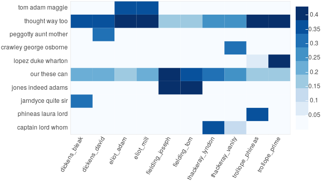

# DARIAH Topics Explorer
This application presents **a user-friendly topic modeling workflow** consisting of data preprocessing, the actual modeling with [latent Dirichlet allocation](http://www.jmlr.org/papers/volume3/blei03a/blei03a.pdf), and the visualization of the model output to explore the semantic content of your text collection.

> If you do not know anything about topic modeling or programming in general, this is where you start.

## Getting started
Windows and macOS users **do not** have to install additional software. The application itself is [portable](https://en.wikipedia.org/wiki/Portable_application).

1. Go to the [release-section](https://github.com/DARIAH-DE/TopicsExplorer/releases/latest) and download the ZIP archive for your OS.
2. Unzip the archive, e.g. using [7-zip](http://www.7-zip.org/).
3. Run the app by double-clicking the file `DARIAH Topics Explorer`.

> If you are on a Mac and get an error message saying that the file is from an “unidentified developer”, you can override it by holding control while double-clicking. The error message will still appear, but you will be given an option to run the file anyway.

Linux users **have to** use the source code and install some dependencies, but Windows and macOS users can of course also do this:

1. Go to the [release-section](https://github.com/DARIAH-DE/TopicsExplorer/releases/latest) and download the **source code** as ZIP archive.
2. Unzip the archive, e.g. using `unzip` via the command-line.
3. Make sure you have [Pipenv](https://docs.pipenv.org/) installed (if not: use `pip install pipenv`).
4. Run `pipenv install`, and afterwards `pipenv shell`.
5. To start the application, type `python topicsexplorer.py`, and press enter.

> If you want to use the sample corpus, you must clone the repository with Git (**not** download the source code from **the release-section**). See also section [The sample corpus](#the-sample-corpus).

## The application


 This application is designed to introduce the technique particularly gently and aims for **simplicity and usability**. If you have a very large text corpus (let’s say more than 200 documents with more than 5000 words per document), you may wish to use more sophisticated models such as those implemented in [MALLET](http://mallet.cs.umass.edu/topics.php), which is known to be more robust than standard LDA. Have a look at our Jupyter notebook introducing [topic modeling with MALLET](https://github.com/DARIAH-DE/Topics/blob/master/IntroducingMallet.ipynb).

## The sample corpus
A sample corpus (10 British novels) is provided in the folder `british-fiction-corpus` in the directory `data`. If you use Git, you can include the corpus, which is actually only a [submodule](https://git-scm.com/book/en/v2/Git-Tools-Submodules) in this repository, by writing:

```
$ git clone --recursive https://github.com/DARIAH-DE/TopicsExplorer.git
```

Or, if you have already cloned the repository:

```
$ cd data/british-fiction-corpus
$ git submodule init
$ git submodule update
```

## Example visualization
The following visualization is based on the distribution of 10 topics over a total of 10 novels (written by Charles Dickens, George Eliot, Joseph Fielding, William Thackeray, and Anthony Trollope). The topics describe the semantic structures of a text corpus. Every document of the corpus consists, to a certain degree, of every topic. This distribution is visualized in a heatmap; the darker the blue, the higher the proportion.

<p align="center">
  
</p>

> **DARIAH Topics Explorer** allows you to analyze and explore your own text corpora using topic models – without prior knowledge or special prerequisites.

## Troubleshooting
* Please be patient. Depending on corpus size and number of iterations, the process may take some time, meaning something between some seconds and some hours.
* If you are confronted with any problems regarding the application, use [GitHub issues](https://github.com/DARIAH-DE/TopicsExplorer/issues) – but suggestions for improvements, wishes, or hints on typos are of course also welcome.
* If you are unable to run Pipenv, e.g. `-bash: pipenv: command not found`, try `python -m pipenv` instead of only `pipenv`. Use `python3` instead of `python` if you are on a Mac or on a Linux machine.
* If you have problems with Pipenv, for example `ModuleNotFoundError: No module named 'pkg_resources.extern'` or `Command "python setup.py egg_info" failed with error code 1`, make sure that the current version of `setuptools` is installed. You can fix that with `pip install --upgrade setuptools` within the virtual environment. Use `pip3` instead of `pip` if you are on a Mac or on a Linux machine.
* If the application fails after pulling from GitHub, try updating the requirements in your virtual environment with `pipenv update`.
* If you are on Ubuntu 18.04 and get the error `[1:1:0100/000000.576372:ERROR:broker_posix.cc(43)] Invalid node channel message` after running the `topicsexplorer.py`, run `sudo apt-get install libglvnd-dev` in your command-line and try again.

## Developing
If you want to run the development version, you can either `git clone` this repository, or download the [ZIP archive](https://github.com/DARIAH-DE/TopicsExplorer/archive/master.zip).

### Requirements
Use [Pipenv](https://docs.pipenv.org/) to install the dependencies:

```
$ pipenv install
```

### Running the application

After spawning a shell within the virtual environment, with `pipenv shell`, you can run the application with:

```
$ python topicsexplorer.py
```

If you wish to access DARIAH Topics Explorer through your web browser, use the following command:

```
$ python topicsexplorer.py --browser
```

### Creating a standalone build
To freeze the Python scripts and create a standalone executable with [PyInstaller](http://www.pyinstaller.org/), simply run:

```
$ git checkout pyinstaller
$ git merge origin/master
$ pyinstaller topicsexplorer.spec
```

## About DARIAH-DE
[DARIAH-DE](https://de.dariah.eu) supports research in the humanities and cultural sciences with digital methods and procedures. The research infrastructure of DARIAH-DE consists of four pillars: teaching, research, research data and technical components. As a partner in [DARIAH-EU](http://dariah.eu/), DARIAH-DE helps to bundle and network state-of-the-art activities of the digital humanities. Scientists use DARIAH, for example, to make research data available across Europe. The exchange of knowledge and expertise is thus promoted across disciplines and the possibility of discovering new scientific discourses is encouraged.

This application has been developed with support from the DARIAH-DE initiative, the German branch of DARIAH-EU, the European Digital Research Infrastructure for the Arts and Humanities consortium. Funding has been provided by the German Federal Ministry for Research and Education (BMBF) under the identifier 01UG1610J.


