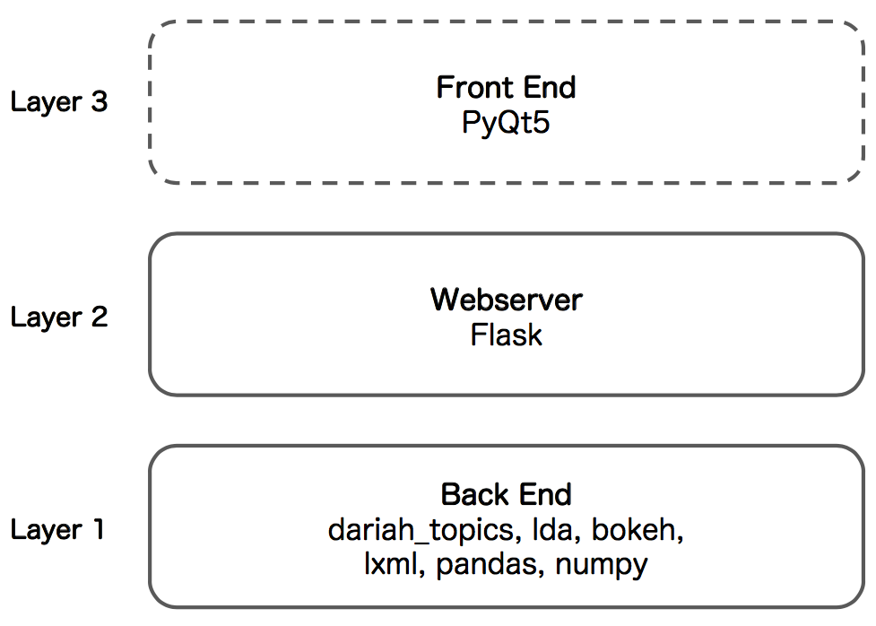

# Topics Explorer: A GUI for Topics – Easy Topic Modeling
This application introduces an user-friendly Topic Modeling workflow, basically containing text data preprocessing, the actual modeling using [latent Dirichlet allocation](http://www.jmlr.org/papers/volume3/blei03a/blei03a.pdf) (LDA), as well as various interactive visualizations.

If you do not know anything about Topic Modeling or programming in general, this is where you start.

## Getting started with the standalone executable
Windows and macOS users **do not** have to install a Python interpreter or anything else. There is currently one standalone build for both Windows and macOS. **Linux users will have to use the development version at the moment**.

1. Go to the [release-section](https://github.com/DARIAH-DE/TopicsExplorer/releases) and download the ZIP archive for your OS.
2. Open it by double-clicking.
3. Unzip the archive, e.g. using [7-zip](http://www.7-zip.org/).
4. Run the app by double-clicking the file `DARIAH Topics Explorer`. (The files in the folder `src` is basically source code. You do not need to worry about that).

> If you are on a Mac and get an error message saying that the file is from an “unidentified developer”, you can override it by holding control while double-clicking. The error message will still appear, but you will be given an option to run the file anyway.

**Topics Explorer** aims for simplicity and usability. If you are working with a large corpus (let's say more than 200 documents, 5000 tokens each document) you may wish to use more sophisticated topic models such as those implemented in [MALLET](http://mallet.cs.umass.edu/topics.php), which is known to be more robust than standard LDA. Have a look at our Jupyter notebook [introducing Topic Modeling with MALLET](https://github.com/DARIAH-DE/Topics/blob/master/IntroducingMallet.ipynb).


### Troubleshooting
* Please be patient. Depending on corpus size and number of iterations, the process may take some time, meaning something between some seconds and some hours.
* If you are on a Mac and get an error message saying that the file is from an “unidentified developer”, you can override it by holding control while double-clicking. The error message will still appear, but you will be given an option to run the file anyway.
* Please use [GitHub issues](https://github.com/DARIAH-DE/TopicsExplorer/issues).


## Working with the development version
**Topics Explorer** basically consists of three layers with an user-interface built on top:

<p align="center">
  
</p>


### Requirements
Besides the standalone executables, you have the ability to run the development version. In this case, you will have to install some dependencies, but first of all:
* At least Python 3.6, from [here](https://www.python.org/downloads/). Python 2 is *not* supported.

You will need the following libraries:
* [`dariah_topics`](https://github.com/DARIAH-DE/Topics) 0.0.6
* [`lda`](https://github.com/lda-project/lda) 1.0.5
* [`bokeh`](https://github.com/bokeh/bokeh) 0.12.13
* [`flask`](https://github.com/pallets/flask) 0.12.2
* [`lxml`](https://github.com/lxml/lxml) 4.1.1
* [`pandas`](https://github.com/pandas-dev/pandas) 0.21.1
* [`numpy`](https://github.com/numpy/numpy) 1.14.0
* [`pyqt5`](https://github.com/baoboa/pyqt5) 5.9.2.

You can install all dependencies using [`pipenv`](http://pipenv.readthedocs.io/en/latest/):

```
pipenv install
```

> If you are on a UNIX-based machine, remember using `python3` instead of `python`.

So far, you could run the application via `python webapp.py` and go to `http://127.0.0.1:5000` in any web browser. If you want a more desktop app-like feeling, you can build *Layer 3* on top and run:

```
python topicsexplorer.py
```


### Contents
* [`bokeh_templates`](bokeh_templates): HTML templates for `bokeh`. This is only relevant, if you want to freeze the scripts with PyInstaller.
* [`hooks`](hooks): Necessary hook files. This is only relevant, if you want to freeze the Python part with PyInstaller.
* [`static`](static) and [`templates`](templates): Static files (e.g. images, CSS, etc.) and HTML templates for the `flask` template engine.
* [`test`](test): Unittest for `webapp.py`, testing all functions of the application.
* [`webapp.py`](webapp.py): Contains 3rd party functions and communicates with the webserver.
* [`topicsexplorer.py`](topicsexplorer.py): A Qt-based UI displaying the contents of the app by running `webapp.py`.
* [`topicsexplorer.spec`](webapp.spec): The build script for PyInstaller containing metadata.


### Troubleshooting
* Please use [GitHub issues](https://github.com/DARIAH-DE/TopicsExplorer/issues).


## Creating a standalone build
To freeze the Python scripts with [PyInstaller](http://www.pyinstaller.org/), simply run:

```
pyinstaller topicsexplorer.spec
```
