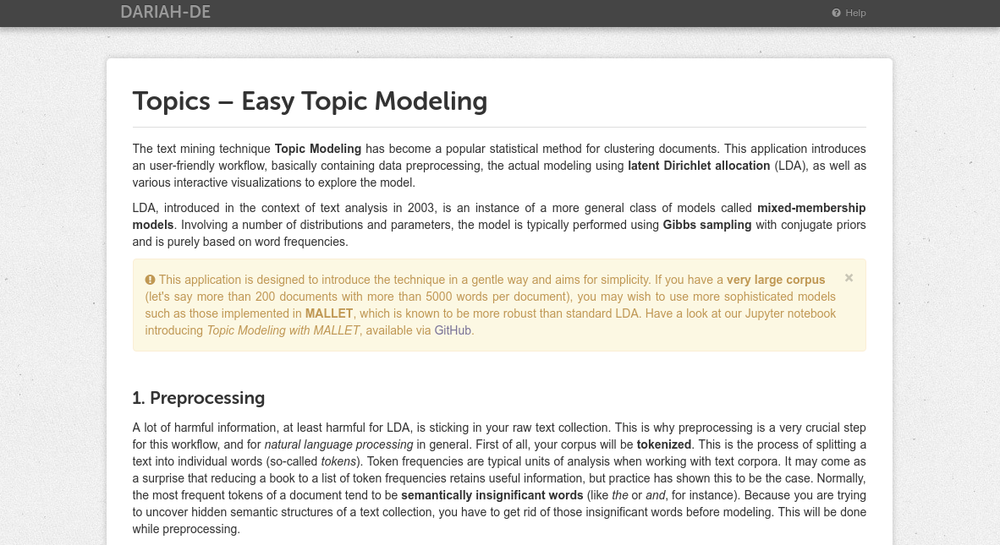

# Demonstrator: GUI for Topics – Easy Topic Modeling

This web application introduces an user-friendly workflow, basically containing data preprocessing, an implementation of the prototypic topic model latent Dirichlet allocation (LDA), as well as one interactive visualization (but more to come).

## First steps

**Important**: Please make sure all dependencies are properly installed, including the `dariah_topics` module. If not (or you are not sure), simply run `pip install -r requirements.txt` (or `pip3 install -r requirements.txt` if you are on an [UNIX-based](https://en.wikipedia.org/wiki/Unix) operating system like macOS or Linux Ubuntu) through the [command-line](https://en.wikipedia.org/wiki/Command-line_interface) within `Topics`.

### Running the application
To run the application, type `python demonstrator.py` (or `python3 demonstrator.py` for UNIX) in the command-line and press enter. Your default browser should immediately display the interface (it might take some seconds until your browser automatically opens – if not, do it by yourself and go to `http://127.0.0.1:5000`). 

**Important**: This application aims for simplicity and usability. If you are working with a large corpus (> 200 documents) you may wish to use more sophisticated topic models such as those implemented in MALLET, which is known to be more robust than standard LDA. Have a look at our Jupyter notebook [introducing topic modeling with MALLET](https://github.com/DARIAH-DE/Topics/blob/testing/IntroducingMallet.ipynb). 

**Hint**: To gain better results, it is highly recommended to use one of the provided [stopword lists](https://github.com/DARIAH-DE/Topics/blob/master/tutorial_supplementals/stopwords). Removing the most frequent words is a dangerous game, because you might remove quite important words.

### Handling the application
The application behaves just like any other website. Basically, there are only two sites: one to select text files and make some more adjustments, and one to show what your topic model has generated. Once clicked the `Send`-button, all generated data will be stored in the cache and you can jump between the pages without losing any data. **But be careful**, once you clicked the `Send`-button again, all of the previous data will be lost.

### Troubleshooting
If you are confronted with any issues, please use `Issues` [on GitHub](https://github.com/DARIAH-DE/Topics/issues). Hopefully, you are able to solve issues by yourself with the help of the following hints:
- Please be patient. Depending on corpus size and number of iterations, topic modeling may take some time, meaning something between some seconds and some hours. Our example corpus should be done within a minute or two. If the application has crashed, you will get an `Internal Server Error` in your browser.
- Logging is available via the commmand-line – this might help you solving problems. One possible error could be `OSError: [Errno 24] Too many open files`, meaning your corpus is too big for this application. In this case, try one of the Jupyter notebooks – they are designed for large corpora.
- Make sure you run `demonstrator.py` within the correct command-line. For example, if you installed WinPython on your machine, you have to use `WinPython PowerShell Prompt.exe` and not `cmd.exe`. If you are using Anaconda, try running `demonstrator.py` through Anaconda.
- In case you want to jump from the output site back to the first page, but your browser displays a blank page, press the reload button. Jumping between sites should be possible within seconds, in any other cases something went wrong.
- If you get a `ModuleNotFoundError`-error, your dependencies are probably not up-to-date. Try running `pip install -r requirements.txt` (or `pip3 install -r requirements.txt` for UNIX) in the command-line within `Topics`.

## Stand-alone application
Although this application is built with Python, it is possible to run it as if it was a native application, without having to install Python or any related packages. There is currently one build for Windows and macOS, respectively.

### Running the stand-alone application
1. Download `demonstrator-0.0.1-windows.zip` or `demonstrator-0.0.1-mac.zip` from the [release-section](https://github.com/DARIAH-DE/Topics/releases/tag/0.0.1).
2. Open it by double-clicking.
3. Run the app by double-clicking.
4. **Mac**: If you get an error message saying that the file is from an “unidentified developer”, you can override it by holding control while double-clicking. The error message will still appear, but you will be given an option to run the file anyway.

## Creating a build
To create a stand-alone application, you need to install `pyinstaller` and run:

1. For Mac: `pyinstaller --onefile --windowed --add-data static:static --add-data templates:templates --additional-hooks-dir hooks demonstrator.py`
2. For Windows: `pyinstaller --onefile --windowed --add-data static;static --add-data templates;templates --additional-hooks-dir hooks demonstrator.py`
